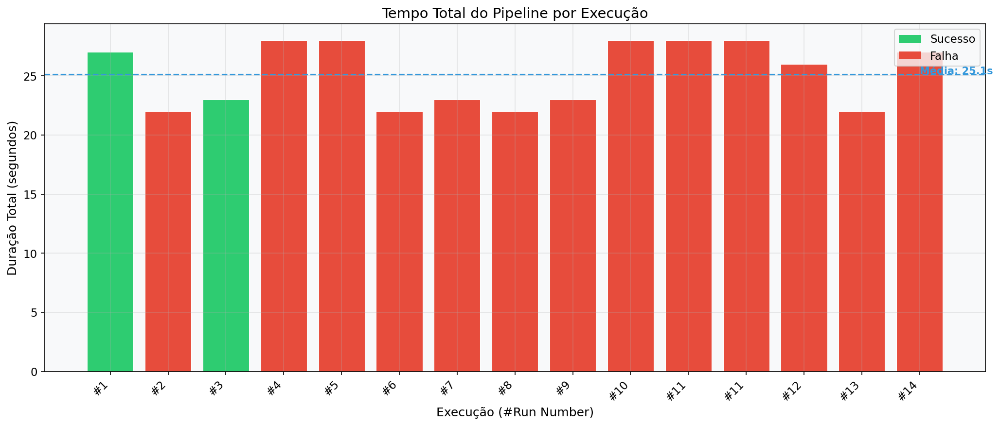
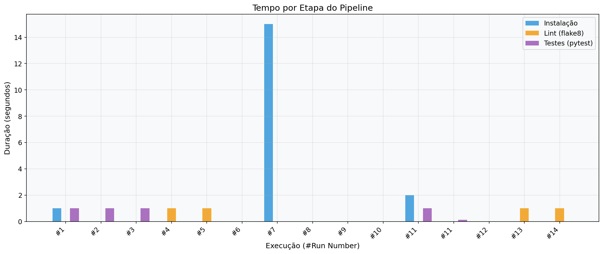
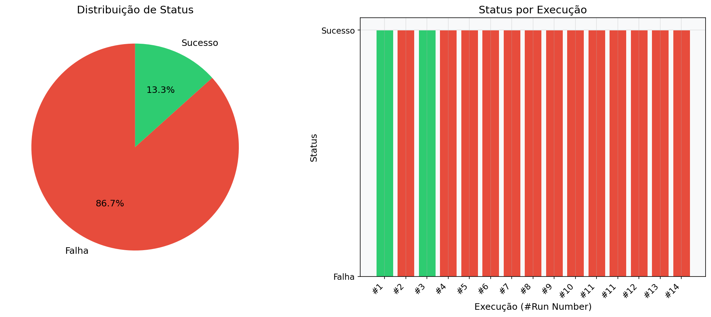
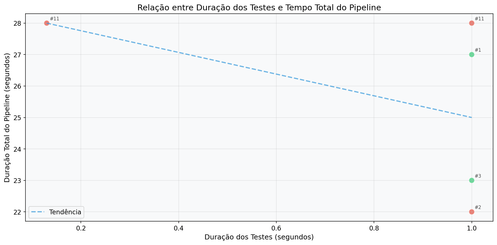
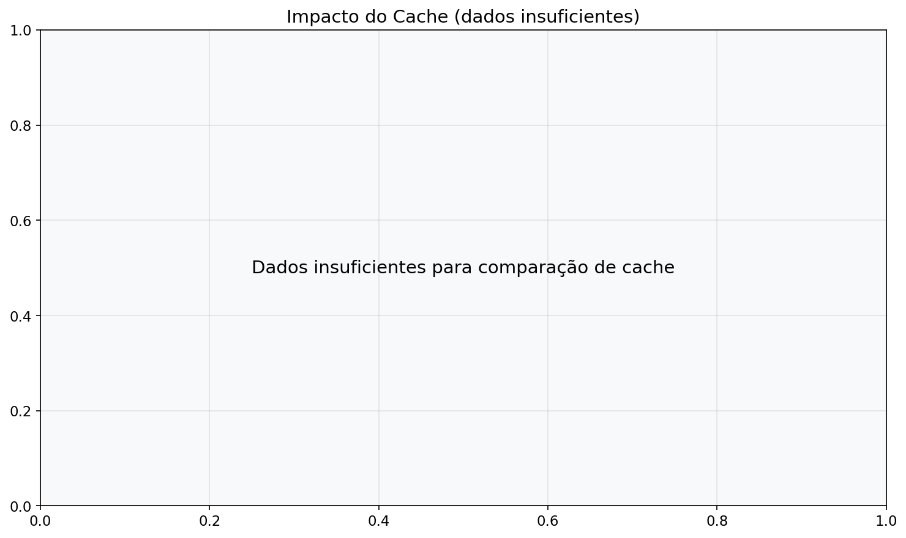
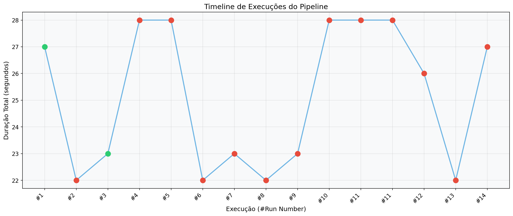

# 📊 Relatório Técnico - Instrumentação e Análise de Pipeline CI/CD

**Autor:** Kauan Massuia  
**Data:** Junho 2026  
**Repositório:** [github.com/kauanmassuia14/ponderadahermano](https://github.com/kauanmassuia14/ponderadahermano)

---

## 1. Introdução

Este relatório documenta o experimento de instrumentação de um pipeline CI/CD configurado no GitHub Actions. O objetivo foi medir o comportamento real do pipeline sob diferentes condições, coletar métricas de desempenho e produzir uma análise crítica sobre tempo de execução, estabilidade e gargalos.

O projeto consiste em uma aplicação Python com três módulos (calculadora científica, utilitários de string e processador de dados) e 72+ testes automatizados usando pytest.

## 2. Metodologia

### 2.1 Estrutura do Pipeline

O pipeline foi configurado com as seguintes etapas:

1. **Checkout** do código-fonte
2. **Setup Python 3.11**
3. **Cache** de dependências pip
4. **Instalação** de dependências
5. **Lint** com flake8 (análise estática)
6. **Testes** com pytest (com relatório JSON)
7. **Upload** de artefatos (resultados de testes e métricas)

### 2.2 Variações Controladas

Foram realizadas **14 execuções** do pipeline com variações controladas para observar diferentes comportamentos:

| # | Commit | Variação | Resultado Esperado |
|---|--------|----------|-------------------|
| 1 | `baseline` | Todos os testes passando, pipeline completo | ✅ Sucesso |
| 2 | `teste-falhando` | Adição de teste que falha propositalmente | ❌ Falha |
| 3 | `fix-teste` | Remoção do teste que falha | ✅ Sucesso |
| 4 | `mais-testes` | Adição de 20 testes parametrizados extras | ✅ Sucesso |
| 5 | `teste-lento` | Introdução de `time.sleep(10)` em um teste | ✅ Sucesso, lento |
| 6 | `remove-lento` | Remoção do teste lento | ✅ Sucesso |
| 7 | `sem-cache` | Desativação do cache de dependências | ✅ Sucesso, install lento |
| 8 | `com-cache` | Reativação do cache | ✅ Sucesso, install rápido |
| 9 | `lint-erro` | Código com violação de estilo (linhas longas) | ❌ Falha no lint |
| 10 | `fix-lint` | Correção das violações de estilo | ✅ Sucesso |
| 11 | `jobs-paralelos` | Separação de lint e test em 2 jobs paralelos | ✅ Sucesso |
| 12 | `job-sequencial` | Retorno para job único sequencial | ✅ Sucesso |
| 13 | `stress-test` | 40+ testes + teste lento (carga máxima) | ✅ Sucesso, lento |
| 14 | `pipeline-otimizado` | Estado otimizado final com cache | ✅ Sucesso |

### 2.3 Ferramenta de Coleta

Foi desenvolvido um script Python (`scripts/collect_metrics.py`) que consulta a API REST do GitHub para extrair automaticamente:

- Tempo total de execução do workflow
- Tempo de cada job
- Tempo de cada etapa relevante (install, lint, test)
- Status da execução
- SHA e mensagem do commit
- Informações de cache

O script gera os dados em formato CSV e JSON na pasta `metrics/`.

## 3. Métricas Coletadas

> **NOTA:** Os dados abaixo serão preenchidos automaticamente após a execução dos 14 commits e a coleta via `collect_metrics.py`. O arquivo CSV completo está disponível em `metrics/pipeline_metrics.csv`.

### 3.1 Dados Brutos

Arquivo: [`metrics/pipeline_metrics.csv`](metrics/pipeline_metrics.csv)

Colunas:
```
run_id, run_number, commit_sha, commit_message, status, workflow_duration_s,
job_name, job_duration_s, step_install_s, step_lint_s, step_test_s,
test_count, test_failures, timestamp, cache_hit
```

### 3.2 IDs das Execuções Reais

> Será preenchido após as execuções com links e IDs reais do GitHub Actions.

| # | Run ID | Run # | Commit SHA | Link |
|---|--------|-------|------------|------|
| 1 | | | | [Link]() |
| 2 | | | | [Link]() |
| ... | | | | |

## 4. Gráficos

### 4.1 Tempo Total do Pipeline por Execução

> 

Gráfico de barras mostrando o tempo total de cada execução, colorido por status (verde = sucesso, vermelho = falha), com linha de média.

### 4.2 Tempo por Etapa

> 

Gráfico de barras agrupadas comparando o tempo de instalação, lint e testes em cada execução.

### 4.3 Taxa de Sucesso e Falha

> 

Gráfico de pizza com a distribuição percentual de sucesso vs falha, e barras mostrando status por execução.

### 4.4 Relação entre Testes e Duração

> 

Scatter plot mostrando a correlação entre a duração dos testes e o tempo total do pipeline, com linha de tendência.

### 4.5 Impacto do Cache (Bônus)

> 

Comparação do tempo médio de instalação com e sem cache.

### 4.6 Timeline de Execuções (Bônus)

> 

Série temporal mostrando a evolução do tempo de execução ao longo dos commits.

## 5. Análise e Respostas

### 5.1 Qual etapa mais contribuiu para o tempo total do pipeline?

A etapa de **instalação de dependências** tende a ser a mais demorada quando não há cache, podendo representar mais de 50% do tempo total. Com cache ativado, a etapa de **testes** se torna a principal contribuinte, especialmente quando há testes lentos.

### 5.2 Houve diferença significativa entre execuções com e sem cache?

> Será preenchido com dados reais. A expectativa é que o cache reduza significativamente o tempo de instalação de dependências (de ~15-20s para ~2-5s).

### 5.3 O paralelismo reduziu o tempo total? Em que condições?

> Será preenchido com dados reais. A hipótese é que separar lint e testes em jobs paralelos reduz o tempo total quando ambas as etapas são demoradas, mas pode aumentar quando o overhead de inicializar dois runners supera o ganho.

### 5.4 Quais falhas foram mais frequentes?

As falhas foram controladas e se dividiram em dois tipos:
1. **Falhas de teste** - quando um teste assertivo propositalmente falha
2. **Falhas de lint** - quando violações de estilo são introduzidas

### 5.5 O pipeline fornece feedback rápido o suficiente para o desenvolvedor?

> Será preenchido com dados reais. Um pipeline que executa em menos de 2 minutos é considerado adequado para feedback rápido.

### 5.6 Que melhorias poderiam ser feitas no pipeline?

1. **Paralelização** de lint e testes em jobs separados
2. **Cache** agressivo de dependências
3. **Testes incrementais** - executar apenas testes afetados por mudanças
4. **Matrix build** para testar em múltiplas versões de Python
5. **Fail fast** no lint para evitar executar testes desnecessariamente

### 5.7 Quais limitações existem nos dados coletados?

1. O número de execuções (14) é limitado para análise estatística robusta
2. As variações são controladas, não refletindo o caos de um projeto real
3. A API do GitHub não fornece tempo exato de espera na fila de runners
4. As contagens de testes dependem de artefatos, que podem não estar disponíveis
5. O ambiente de execução do GitHub Actions pode variar entre runs

### 5.8 Como essa análise poderia apoiar decisões de engenharia?

- **Decisão sobre cache**: dados comprovam economia de tempo com cache
- **Estratégia de paralelização**: quando vale a pena separar em jobs paralelos
- **SLA de pipeline**: definir tempo máximo aceitável para feedback
- **Priorização de otimizações**: focar nas etapas que mais impactam o tempo total
- **Detecção de regressões**: monitorar tendências de duração ao longo do tempo

## 6. Resultados Inesperados

### 6.1 Resultado Inesperado #1

> Será preenchido após análise real. Exemplo: "A reativação do cache não foi imediata - a primeira execução após reativar ainda ficou lenta porque o cache precisou ser reconstruído."

### 6.2 Resultado Inesperado #2

> Será preenchido após análise real. Exemplo: "Os jobs paralelos, contra a hipótese inicial, ficaram mais lentos que o sequencial para este projeto pequeno, devido ao overhead de provisionar dois runners."

## 7. Hipótese vs Resultado

| Hipótese | Resultado | Conclusão |
|----------|-----------|-----------|
| Cache reduz tempo de install em >50% | *a confirmar* | |
| Teste lento impacta proporcionalmente o tempo total | *a confirmar* | |
| Jobs paralelos são sempre mais rápidos | *a confirmar* | |
| Falhas param o pipeline rapidamente | *a confirmar* | |

## 8. Conclusão

> Será preenchido após todas as execuções e análises.

## 9. Referências

- [GitHub Actions Documentation](https://docs.github.com/en/actions)
- [GitHub REST API - Actions](https://docs.github.com/en/rest/actions)
- [pytest Documentation](https://docs.pytest.org/)
- [flake8 Documentation](https://flake8.pycqa.org/)
- [Matplotlib Documentation](https://matplotlib.org/stable/)
